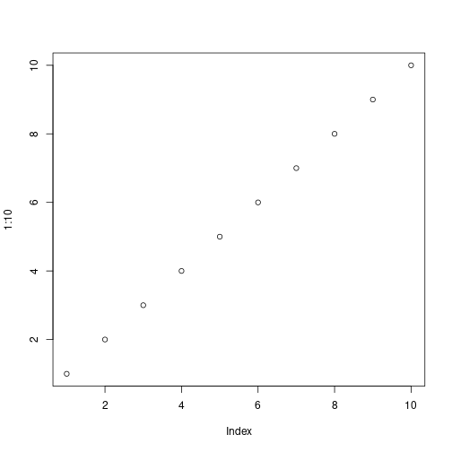
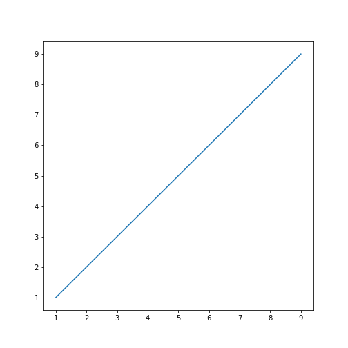

Change the knit root directory to the temporary R session.


```r
knitr::opts_knit$set("root.dir" = tempdir())
```


```r
getwd()
```

```
## [1] "/tmp/RtmpOJQVHt"
```


```r
library("reticulate")
matplotlib <- import("matplotlib")
```


```r
reticulate::py_config()
```

```
## python:         /home/tomasz/.virtualenvs/r-reticulate/bin/python
## libpython:      /usr/lib/python3.10/config-3.10-x86_64-linux-gnu/libpython3.10.so
## pythonhome:     /home/tomasz/.virtualenvs/r-reticulate:/home/tomasz/.virtualenvs/r-reticulate
## version:        3.10.12 (main, Nov 20 2023, 15:14:05) [GCC 11.4.0]
## numpy:          /home/tomasz/.virtualenvs/r-reticulate/lib/python3.10/site-packages/numpy
## numpy_version:  1.26.3
```

The R plot is saved relative to the location of the Rmd file:


```r
plot(1:10)
```



The Python plot is also saved relative to the location of the Rmd file (not root.dir):


```python
import matplotlib.pyplot as plt

x = range(1, 10)
plt.plot(x, x)
```




```r
knitr::opts_knit$get("root.dir")
```

```
## [1] "/tmp/RtmpOJQVHt"
```

```r
( file.exists(file.path(knitr::opts_knit$get("root.dir"), "figure", "r-plot-1.png")))    #stop("figure saved in wrong place")
```

```
## [1] FALSE
```

```r
( file.exists(file.path(knitr::opts_knit$get("root.dir"), "figure", "py-plot-1.png")))   #stop("figure saved in wrong place")
```

```
## [1] FALSE
```

```r
(!file.exists(file.path(knitr::opts_knit$get("output.dir"), "figure", "r-plot-1.png")))  #stop("figure saved in wrong place")
```

```
## [1] FALSE
```

```r
(!file.exists(file.path(knitr::opts_knit$get("output.dir"), "figure", "py-plot-1.png"))) #stop("figure saved in wrong place")
```

```
## [1] FALSE
```
